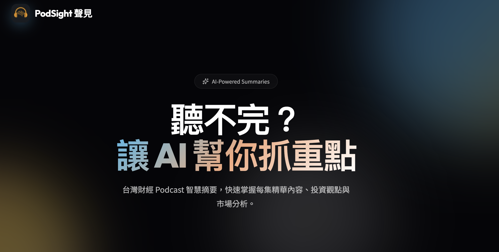
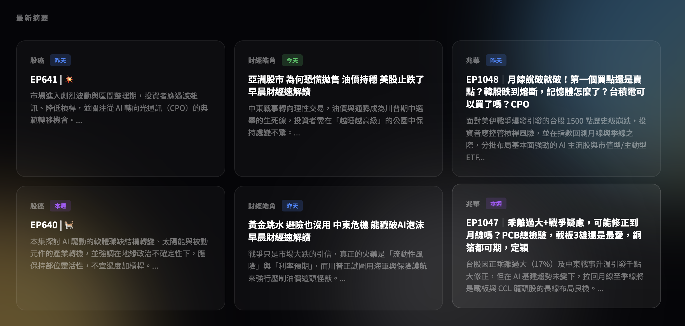
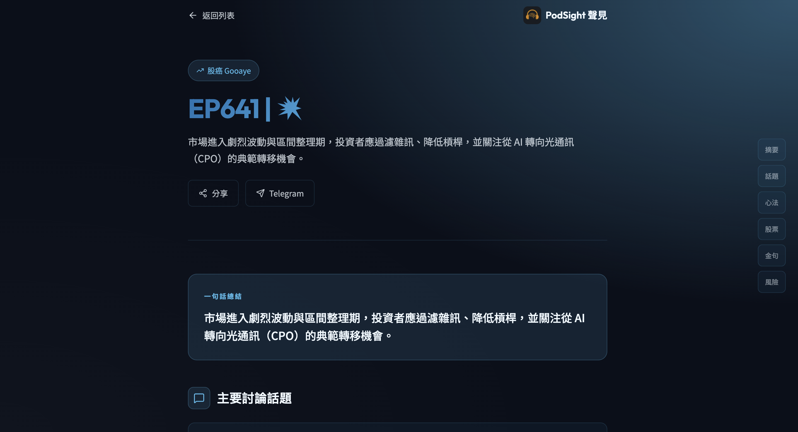
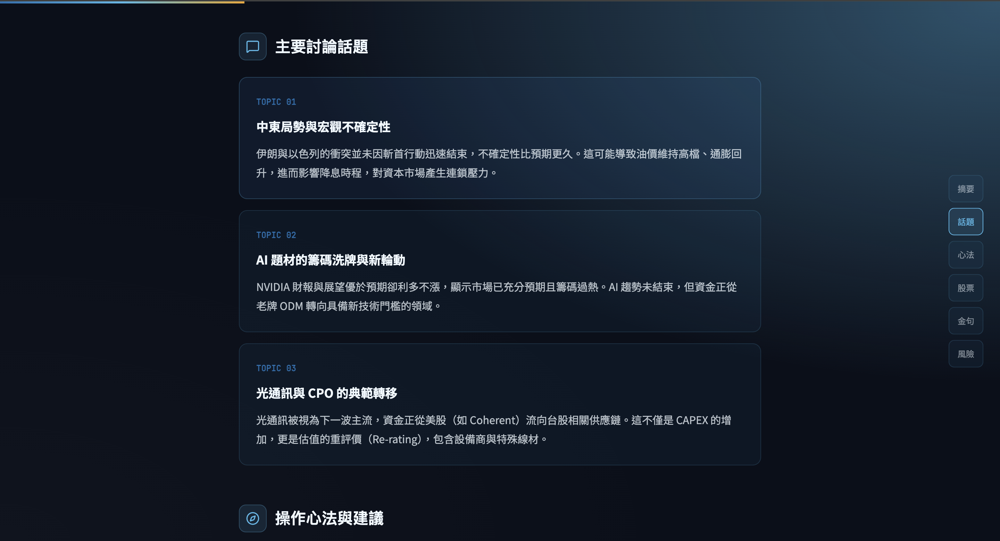
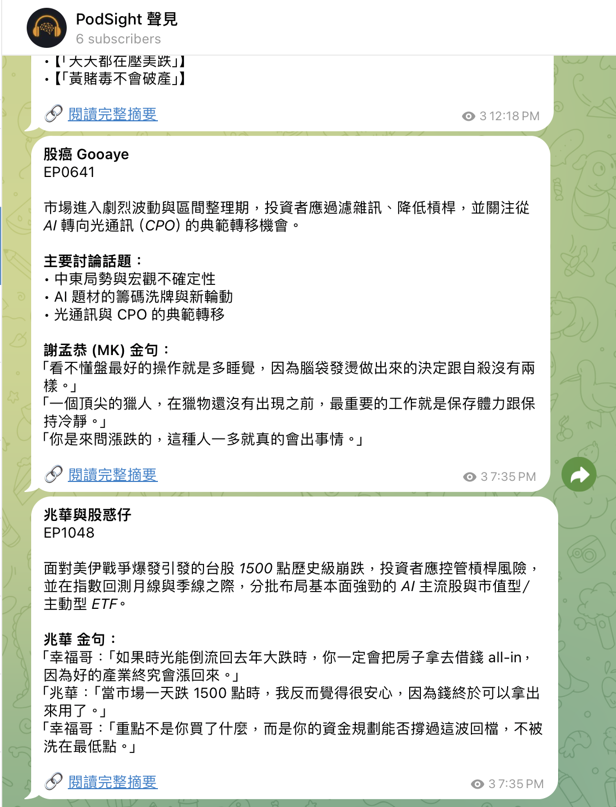
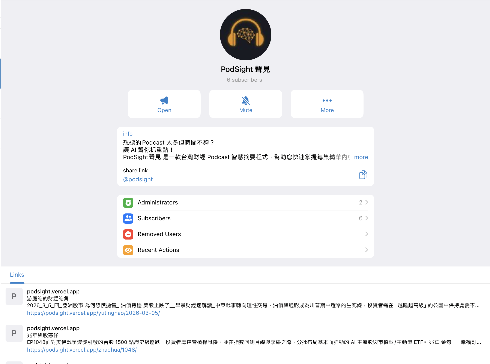
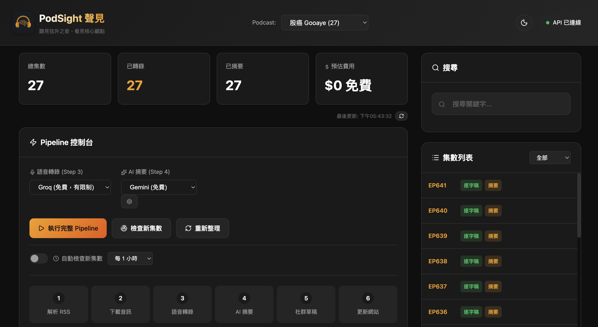
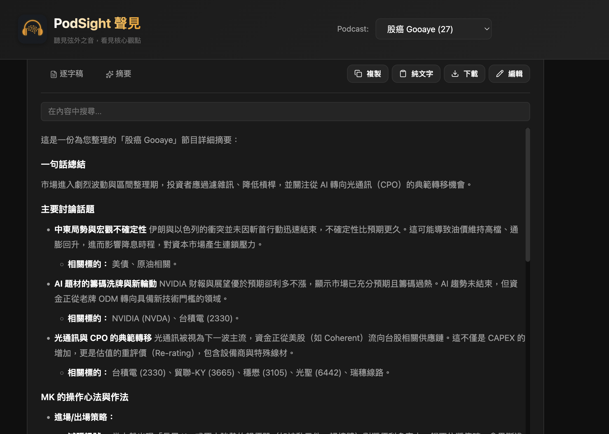

# PodSight 聲見

**Turn podcast audio into structured, searchable intelligence — automatically.**

PodSight is a fully automated pipeline that transcribes, summarizes, and publishes Taiwan finance podcasts. New episodes are detected via RSS, transcribed with Whisper, summarized by Gemini AI, published to a beautiful static site, and pushed to Telegram — all running on GitHub Actions, twice daily, zero human intervention.

**Live site:** [podsight.vercel.app](https://podsight.vercel.app)  |  **Telegram:** [@podsight](https://t.me/podsight)

<p align="center">
  
</p>

## How It Works

```
RSS Feed --> Download MP3 --> Whisper Transcription --> Gemini Summary --> Static Site --> Telegram
```

Every day at 10 AM and 7 PM (Taiwan time), GitHub Actions:

1. **Fetches RSS feeds** for all configured podcasts
2. **Detects new episodes** by comparing RSS against existing summaries
3. **Downloads audio** and **transcribes** via Groq Whisper API
4. **Generates AI summaries** with Gemini — structured with key topics, stock mentions, market insights
5. **Builds a static site** with individual episode pages (deployed to Vercel)
6. **Pushes to Telegram** after verifying the Vercel deployment is live

## Public Site

The generated site features a dark-themed, mobile-friendly design with episode cards and detailed summary pages.

<p align="center">
  
</p>

Each episode page includes a one-line summary, structured topic breakdowns, stock mentions, and actionable insights — all extracted by AI from the full transcript.

<p align="center">
  
  <br>
  
</p>

## Telegram Channel

Summaries are automatically pushed to the [@podsight](https://t.me/podsight) Telegram channel with direct links to the full summary page.

<p align="center">
  
  &nbsp;&nbsp;
  
</p>

## Web Dashboard

A local admin dashboard for managing the pipeline, browsing episodes, editing summaries, and searching across all transcripts.

<p align="center">
  
</p>

<p align="center">
  
</p>

## Podcasts Currently Tracked

| Podcast | Host | Schedule | Episodes |
|---------|------|----------|----------|
| [股癌 Gooaye](https://podsight.vercel.app/gooaye/) | 謝孟恭 (MK) | Wed / Sat | 27+ summaries |
| [游庭皓的財經皓角](https://podsight.vercel.app/yutinghao/) | 游庭皓 | Daily ~9 AM | 42+ summaries |
| [兆華與股惑仔](https://podsight.vercel.app/zhaohua/) | 兆華 | Daily afternoon | 39+ summaries |

Adding a new podcast is a single entry in `podcasts.yaml` — no code changes needed.

## Quick Start

### Prerequisites

- Python 3.10+
- FFmpeg (`brew install ffmpeg` on macOS)

### Setup

```bash
git clone https://github.com/jazzpujols34/podsight.git
cd gooaye_pipeline

python -m venv venv
source venv/bin/activate
pip install -r requirements.txt
```

Create a `.env` file:

```env
GROQ_API_KEY=your_groq_api_key        # Whisper transcription
GEMINI_API_KEY=your_gemini_api_key     # AI summarization
TELEGRAM_BOT_TOKEN=your_bot_token      # Optional: Telegram push
TELEGRAM_CHAT_ID=your_chat_id          # Optional: Telegram push
```

### Run the Full Pipeline

```bash
# Auto-detect and process all new episodes across all podcasts
python src/pipeline/auto_pipeline.py
```

### Run Individual Steps

```bash
# Target a specific podcast
PODCAST=gooaye python src/pipeline/01_parse_rss.py      # Fetch RSS
PODCAST=gooaye python src/pipeline/02_download_audio.py  # Download MP3s
PODCAST=gooaye python src/pipeline/03_transcribe.py      # Transcribe
PODCAST=gooaye python src/pipeline/04_summarize.py       # Summarize
PODCAST=gooaye python src/pipeline/05_generate_social.py # Generate social drafts
```

### Web Dashboard

```bash
python src/server.py --port 3501
# Open http://localhost:3501
```

The dashboard lets you browse episodes, view transcripts/summaries, edit drafts, search across all content, and trigger pipeline runs manually.

## Adding a New Podcast

Edit `podcasts.yaml`:

```yaml
podcasts:
  my_podcast:
    name: "My Podcast"
    slug: my_podcast
    host: "Host Name"
    rss_url: "https://example.com/feed.xml"
    language: zh
    episode_pattern: 'EP(\d+)'  # Regex to extract episode number (null for date-based)
    max_episodes: 30             # Limit for daily podcasts
```

That's it. The pipeline will pick it up on the next run.

## Project Structure

```
gooaye_pipeline/
├── src/
│   ├── config.py                  # Podcast configs, shared utilities
│   ├── server.py                  # FastAPI web dashboard (port 3501)
│   ├── pipeline/
│   │   ├── 01_parse_rss.py        # RSS feed -> episodes.json
│   │   ├── 02_download_audio.py   # Download MP3 files
│   │   ├── 03_transcribe.py       # Audio -> text (Groq Whisper)
│   │   ├── 04_summarize.py        # Transcript -> summary (Gemini)
│   │   ├── 05_generate_social.py  # Summary -> social media drafts
│   │   ├── auto_pipeline.py       # Orchestrator: runs all steps
│   │   ├── generate_public_site.py # Static HTML generator
│   │   └── push_telegram_batch.py # Telegram channel publisher
│   └── social/
│       ├── formatters/            # Platform-specific formatters (Telegram, Twitter, etc.)
│       └── publishers/            # Platform publish adapters
├── ui/                            # Web dashboard frontend (SPA)
├── public-site/                   # Generated static site (deployed to Vercel)
├── data/{podcast}/                # Per-podcast data
│   ├── episodes.json              # RSS metadata
│   ├── transcripts/*.txt          # Transcription output
│   ├── summaries/*_summary.txt    # AI-generated summaries
│   └── social_drafts/             # Telegram/social media drafts
├── podcasts.yaml                  # Podcast configuration
├── requirements.txt               # Python dependencies
└── .github/workflows/
    └── auto-pipeline.yml          # Scheduled CI/CD (twice daily)
```

## Deployment

The production setup uses three services:

| Service | Purpose | Trigger |
|---------|---------|---------|
| **GitHub Actions** | Runs pipeline twice daily (10 AM + 7 PM Taiwan) | Cron schedule |
| **Vercel** | Hosts the static site | Auto-deploy on git push |
| **Telegram Bot** | Pushes summaries to [@podsight](https://t.me/podsight) | After Vercel deploy is verified |

GitHub Actions secrets needed: `GROQ_API_KEY`, `GEMINI_API_KEY`, `TELEGRAM_BOT_TOKEN`, `TELEGRAM_CHAT_ID`

## Tech Stack

- **Transcription:** [Groq](https://groq.com/) Whisper API (whisper-large-v3)
- **Summarization:** [Google Gemini](https://ai.google.dev/) with custom prompts per podcast
- **Backend:** Python, FastAPI
- **Frontend:** Vanilla HTML/CSS/JS SPA (no framework)
- **Static Site:** Custom HTML generator with Lucide icons, dark theme
- **CI/CD:** GitHub Actions
- **Hosting:** Vercel (static site)
- **Distribution:** Telegram Bot API

## License

MIT — Pipeline code is open source. Podcast content belongs to respective creators.
